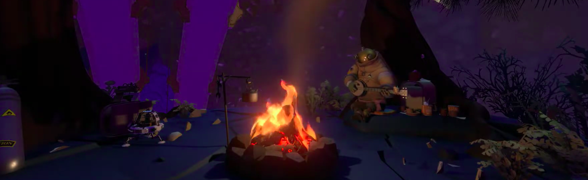

  <h1>Erick Anderson dos Santos</h1>
  
Olá! Me chamo Erick, tenho 21 anos, sou estudante de Engenharia de Software e atualmente trabalhando na empresa ASAAS.

## Tecnologias
       

## Estatísticas

  
  

## Onde me encontrar
  
